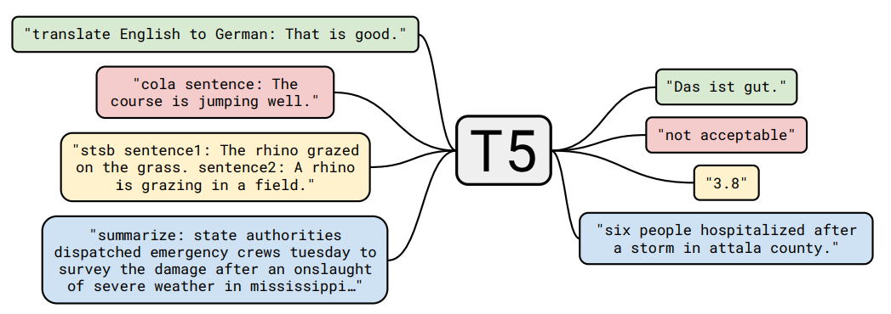

# KoT5
**Korean Text-To-Text Transfer Transformer**

## Introdution

 \
[T5(text-to-text-transfer-transformer)](https://arxiv.org/abs/1910.10683)
는 입력과 출력이 항상 텍스트 문자열인 Text to Text 프레임워크를 사용하여 모든 NLP Task들을 일반화합니다.
분류, 순차태깅, 기계 번역, 문서 요약, QA 등의 Task를 동일한 모델과 파라미터를 사용하여 범용적으로 학습 할 수 있습니다. 

KoT5의 사전학습을 위해 위키 백과 및 신문기사 등 23개 종류의 출처에서 총 939GB의 raw데이터를 수집했고,
전처리 후 약 42GB의 한국어 말뭉치가 사용되었습니다.

본 저장소에서는 KoT5-Small과 KoT5-Base 모델을 다운로드 할 수 있으며,
Tensorflow 버전과 Pytorch 버전의 모델 실행 방법이 포함되어 있습니다.


## Pre-trained Checkpoints

| model | layers | hidden_size | parameter | tensorflow | pytorch
| --- | --- | --- | --- | --- | --- |
| KoT5-Small | 6 | 512 | 60M | [link](https://storage.googleapis.com/nlp_bucket-1/KoT5_models/small.zip) | [link](https://storage.googleapis.com/nlp_bucket-1/KoT5_models/small_hf.zip)
| KoT5-Base | 12 | 768 | 220M | [link](https://storage.googleapis.com/nlp_bucket-1/KoT5_models/base.zip) | [link](https://storage.googleapis.com/nlp_bucket-1/KoT5_models/base_hf.zip)

학습된 모델은 [Google Reaserch의 소스](https://github.com/google-research/text-to-text-transfer-transformer) 를 사용하여 학습되었으며,
모델별로 기타 Config는 논문의 세팅에 따라 그대로 설정하였습니다.

## Usage

[Tensorflow 버전](./kot5/README.md) \
[Pytorch 버전](./kot5_hf/README.md)

## Experiment

|                       | **NSMC**<br/>(acc) | **KorSTS**<br/>(spearman) | ***Summarization**<br/>(rouge f1) |
| :-------------------- | :----------------: | :--------------------: | :----------------: | 
| KoGPT[[1]](https://github.com/kakaobrain/kogpt)                |       89.59        |         87.92          |       -        | 
| KoGPT2-base[[2]](https://github.com/SKT-AI/KoGPT2)      |       89.03        |         86.65          |      -        |
| KoBART-base[[3]](https://github.com/SKT-AI/KoBART)               |       90.06        |         87.70          |       51.5, 35.1, 41.5        |
| **KoT5-small**       |       **88.50**        |         **-**          |       **50.79, 34.25, 42.40**        |
| **KoT5-base**    |       **90.66**        |         **-**         |       **52.50, 35.87, 43.47**      | 
*문서요약의 경우 [Dacon 문서 생성요약 경진대회](https://dacon.io/competitions/official/235671/data) 의 데이터와 매트릭을 사용했습니다. 


## Citation

모델을 연구용으로 사용하는 경우 아래와 같이 인용해주시기 바랍니다.
```
@misc{wisenut2021kot5,
  title         = {KoT5: Wisenut Research Korean Text-To-Text Transfer Transformer},
  author        = {Bongsu Kim and Saebyeok Lee},
  year          = {2021},
  howpublished  = {\url{https://github.com/wisenut-research/KoT5}},
}
```

## License

**KoT5**는 [CC-BY-NC-SA 4.0](https://creativecommons.org/licenses/by-nc-sa/4.0/) 라이선스 하에 공개되어 있습니다. \
모델을 사용할 경우 라이선스 내용을 준수해주세요. 라이선스 전문은 [LICENSE](./LICENSE) 파일에서 확인하실 수 있습니다.

